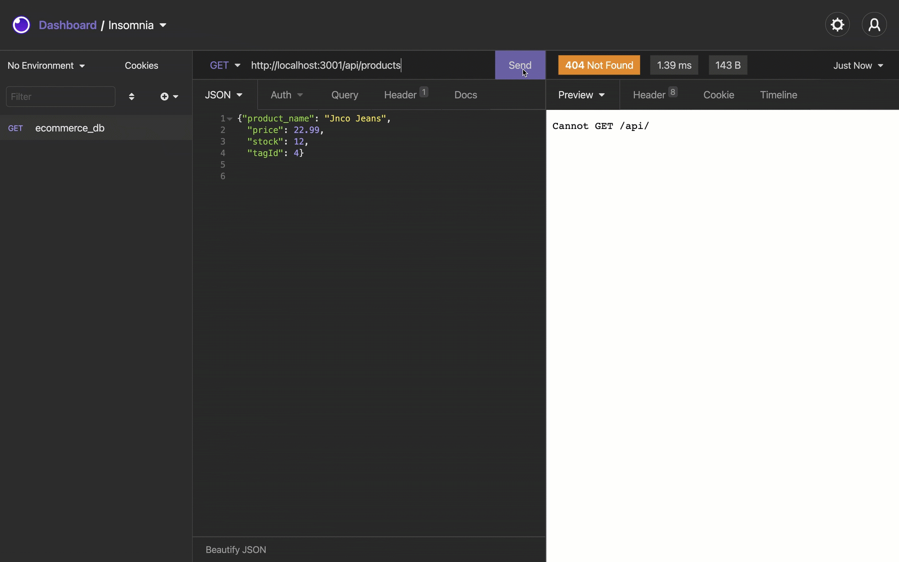

# E-Commerce Back End

## Task

My task was to build the back end for an e-commerce site by modifying starter code, using an Express.js API to use Sequelize to interact with a MySQL database.


## User Story

```md
AS A manager at an internet retail company
I WANT a back end for my e-commerce website that uses the latest technologies
SO THAT my company can compete with other e-commerce companies
```

## Acceptance Criteria

### THE USER CAN: 
1. Add database name, MySQL username, and MySQL password to an environment variable file
2. Connect to a database using Sequelize
3. Enter schema and seed commands to create database with test data
4. Enter "npm start" to start server and sync with database
5. GET routes in Insomnia Core and display categories, products, or tags
6. POST, PUT, and DELETE data in database in Insomnia

## Mock-Up
The following videos demonstrate the program the database being created and seeded through the CLI and the CRUD functionality of tag, product and categry paths :





